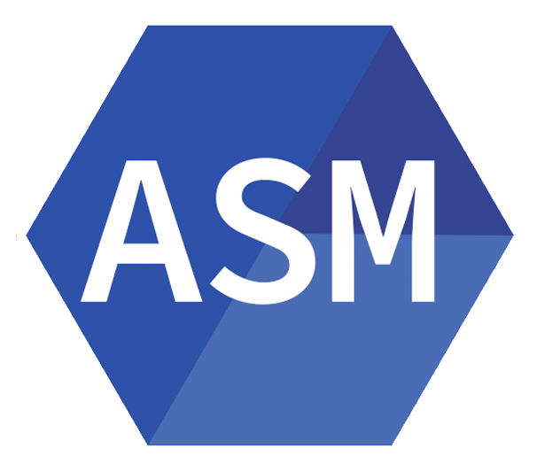

# 🎒 Dezly Saga 
___

## About

This is a central place to keep track of my progress and all of the efforts I'm making
towards my goals.

This where I will tell my story. One key press at a time. 

This is the saga of Dezly Macauley.

>“Without great solitude, no serious work is possible”
>  Pablo Picasso.

___
### Systems Programming

**`Low-Level Control (No garbage collection)`**

    
    
    

1. Rust
2. Zig
3. C

**`Higher-Level Control (Garbage collection)`**

    

1. Go

**`Assembly Languages`**

    

1. Assembly

___
### Artificial Intelligence

**`Frameworks`**

    

6. TensorFlow (Python)

___
### Database Management

**`SQL Databases`**

    

1. SQLite

___
### Smart Contract Development

**`Programming Languages`**

    

1. Vyper (Python)

**`Frameworks`**

    

1. Moccasin (Vyper, Python)

___
### Web Development 

**`Frameworks`**

    
    
    

1. Django (Python)
2. Svelte (TypeScript)
3. Tailwind CSS (CSS) 

**`Build Tools`**

    
    

1. uv (Python)
2. Vite (TypeScript) 

**`Core Languages`**

    
    
    
    

1. HTML
2. CSS (HTML)
3. TypeScript
5. Python

___
