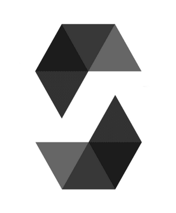
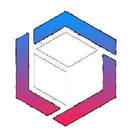

# 🎒 Dezly Saga 
___

## About

This is a central place to keep track of my progress and all of the efforts I'm making
towards my goals.

This where I will tell my story. One key press at a time. 

This is the saga of Dezly Macauley.

    

>“Without great solitude, no serious work is possible”
>  Pablo Picasso.

___
### Systems Programming

**`Lower-Level Control`**

    
    
    

1. Rust
2. Zig
3. C

**`Garbage Collected`**

    

1. Go
___
### Artificial Intelligence

**`Core Languages`**

    

1. Python
___
### Database Management

**`SQL Databases`**

    
    

1. PostgreSQL
2. SQLite

___
### Smart Contract Development

**`Frameworks`**

    
    
    
    

1. Solidity and Foundry 
2. Vyper and Moccasin

___
### Web Development 

**`Frameworks`**

    
    
    
    

1. React and Next.js
2. Svelte and SvelteKit
3. Tailwind CSS

**`Build Tools`**

    
    
    

1. Vite
2. Turbopack
3. Bun

**`Core Languages`**

    
    
    
    

1. TypeScript
2. JavaScript
3. CSS 
4. HTML
___
### Mobile Development 

**`Cross-Platform Development`**

    

1. React Native
___
