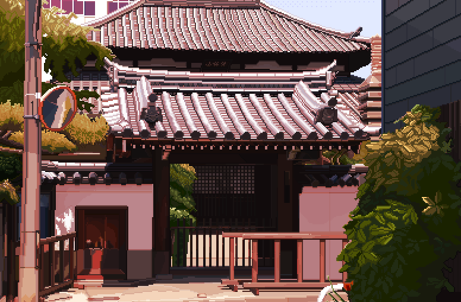

# Dezly Dojo

    
    

_______________________________________________________________________________
## Back-End Development
_______________________________________________________________________________
### Database Mangement

1. **SQLite**
_______________________________________________________________________________
### Systems Programming

1. **Rust**
2. **Go**
_______________________________________________________________________________
### AI and Web3

1. **Vyper**
2. **Moccassin**
3. **Python**

_______________________________________________________________________________
#### Development Tools

1. **uv**

_______________________________________________________________________________
### Front-End Development

#### Frameworks

1. **Svelte**
_______________________________________________________________________________
#### Core Language

1. **TypeScript**
- JavaScript
_______________________________________________________________________________
#### User Interface

1. **Tailwind CSS**
2. **HTML**
- CSS

_______________________________________________________________________________
#### Development Tools

1. **Deno**
2. **Vite**
_______________________________________________________________________________
### Scripting

1. **Bash**
2. **Lua**
_______________________________________________________________________________
### Documentation

1. **Markdown**
_______________________________________________________________________________
